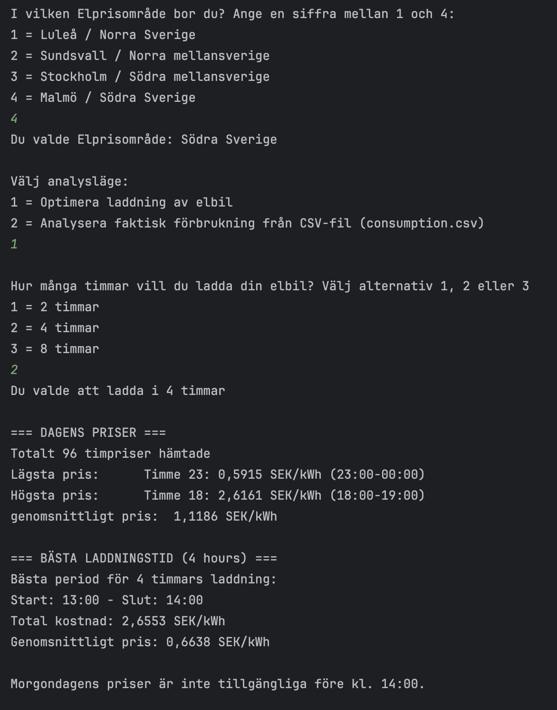

### Electricity Price Client Java
The startup file is called electricityPriceClient.java
This is a CLI-program that retrieves electricity prices from elprisetjustnu.se for the current day and the next day (if available).
Print the mean price for the current 24-hour period and the next day if the time is after 14.00.

The program identifies and print the hours with the cheapest and most expensive prices. If multiple hours share the same price, select the earliest hour.
You can also find out which time of day is the cheapest to charge your electric car at 2, 4 or 8 hours or you can choose an analysis mode to compute charging cost from a consumption CSV which is included.

